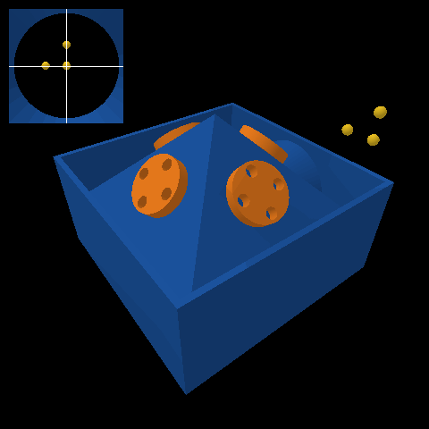
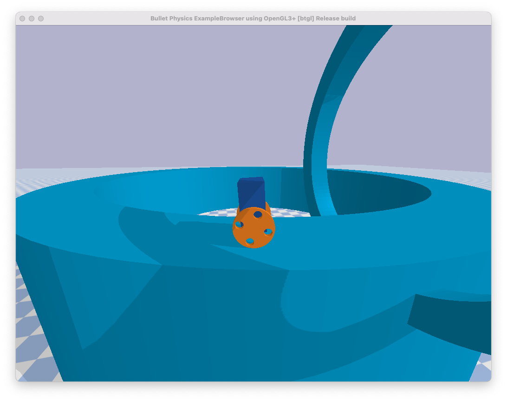
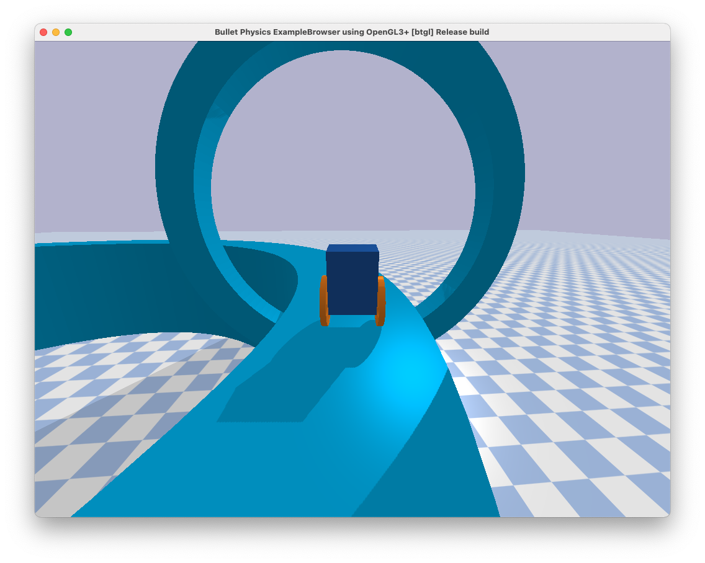
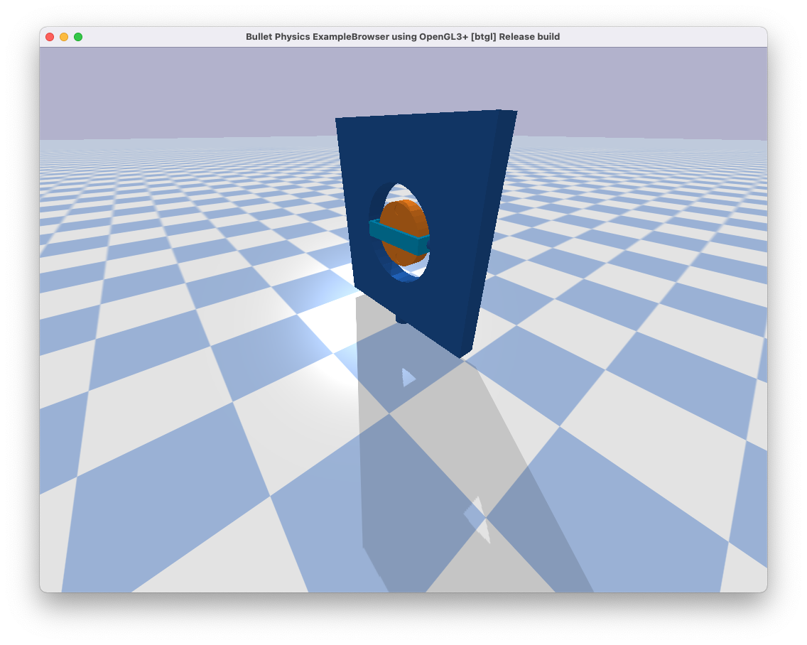

## Contents
{:.no_toc}

* This text will be replaced by a table of contents (excluding the above header) as an unordered list
{:toc}

---

## Design Project \#3 (Spacecraft with star tracker)

### The system

The third project that you will complete this semester is to design, implement, and test a controller that enables a spacecraft to maintain a fixed orientation, as pictured below:



This spacecraft (blue) has four reaction wheels (orange) that are arranged in a pyramid.

The actuators are motors that allow a torque to be applied by the spacecraft to each wheel, up to a maximum of $\pm 5\;\text{N}\cdot\text{m}$. The rotational motion of the system is governed by ordinary differential equations with the following form:

$$\begin{bmatrix} \dot{\phi} \\ \dot{\theta} \\ \dot{\psi} \\ \dot{w_x} \\ \dot{w_y} \\ \dot{w_z} \end{bmatrix} = f\left(\phi, \theta, \psi, w_x, w_y, w_z, \tau_1, \tau_2, \tau_3, \tau_4\right)$$

In these equations:

* $\phi$ is the **roll angle** (rad)
* $\theta$ is the **pitch angle** (rad)
* $\psi$ is the **yaw angle** (rad)
* $w_x$ is the **angular velocity about the body-fixed $x$ axis** (rad/s), which points forward
* $w_y$ is the **angular velocity about the body-fixed $y$ axis** (rad/s), which points left
* $w_z$ is the **angular velocity about the body-fixed $z$ axis** (rad/s), which points up
* $\tau_1$ is the **torque applied to wheel 1** ($N\cdot\text{m}$), which is in front
* $\tau_2$ is the **torque applied to wheel 2** ($N\cdot\text{m}$), which is in back
* $\tau_3$ is the **torque applied to wheel 3** ($N\cdot\text{m}$), which is on the left
* $\tau_4$ is the **torque applied to wheel 4** ($N\cdot\text{m}$), which is on the right

A [symbolic description of these equations of motion]({{ site.github.repository_url }}/tree/main/projects/03_spacecraft/DeriveEOM.ipynb) is provided with the [project code]({{ site.github.repository_url }}/tree/main/projects/03_spacecraft).

The sensor is a star tracker. It measures the position of each star and returns that position either as its 2D position in an image if the star is within the field of view or as "not a number" (i.e., `np.nan`) if the star is not within the field of view. This measurement has the following form for each star:

$$\begin{bmatrix} y_\text{star} \\ z_\text{star} \end{bmatrix} = g(\phi, \theta, \psi, \alpha, \delta)$$

You will already recognize the roll, pitch, and yaw angles in this equation. The other variables are:

* $\alpha$ is the **right ascension** (rad) of the star
* $\delta$ is the **declination** (rad) of the star

Again, a [symbolic description of this equation]({{ site.github.repository_url }}/tree/main/projects/03_spacecraft/DeriveEOM.ipynb) is provided with the [project code]({{ site.github.repository_url }}/tree/main/projects/03_spacecraft).

The code provided [here]({{ site.github.repository_url }}/tree/main/projects/03_spacecraft) simulates the motion of this system ([SpacecraftDemo]({{ site.github.repository_url }}/tree/main/projects/03_spacecraft/SpacecraftDemo.ipynb)) and also derives both the equations of motion and the sensor model in symbolic form ([DeriveEOM]({{ site.github.repository_url }}/tree/main/projects/03_spacecraft/DeriveEOM.ipynb)).

The goal is to keep the spacecraft fixed at zero roll, pitch, and yaw despite noisy sensor measurements and a shooting star (!?!).


### Your tasks

The focus of your analysis this time will be on data collection. The initial conditions, the sensor measurements, and the disturbances are random. So, for a given control design, your results will vary (perhaps significantly). It is not enough to look at the results of one simulation---you will have to look at the results of many simulations. At minimum, for each design you consider, you should do the following:

* Collect data from at least 100 simulations.
* Compute the minimum, maximum, median, mean, and standard deviation of the mean square error in roll, pitch, and yaw angles.
* Plot a histogram of the mean square error in roll, pitch, and yaw angles.

Remember that the simulation code provides an option to turn the display off, which can speed up data collection a lot.

#### Things you need to do

First, do all of these things:

* Define a [requirement](#what-is-a-requirement) and a [verification](#what-is-a-verification), just as you did in the [second design project](#design-project-2-differential-drive-robot).
* Linearize the equations of motion and the sensor model.
* Show that the linearized system is both controllable and observable.
* Design a stable controller and a stable observer.
* Implement both the controller and observer and test them in simulation.
* Follow the instructions you wrote to verify that your requirement is (or is not) satisfied.
* Include at least one figure of aggregate results (e.g., a histogram).
* Include at least one figure that provides evidence the observer is working (e.g., a plot of error in the state estimation as a function of time).

Then, consider at least one of the following questions:

* How do your results change with different amounts of sensor noise?
* How do your results change with a different number or arrangement of stars? (This is something you can choose!)
* Can you design a controller that allows you to recover from losing sight of one or more stars?

You are also welcome to consider a similar question that you come up with on your own (e.g., see the list of suggested questions for the other design projects).

### Your deliverables (by ~~Wednesday, April 14~~ Friday, April 16)

#### Video

This video will satisfy the following requirements:

* It must show your working control system.
* It must visualize your answer to one question that you considered.
* It must include some description (e.g., as text or voice) of what is being shown.
* It must stay professional (use good sense, please).

It is best if this video is created by direct screen-capture rather than, for example, by taking a video of the screen with a cell phone.

It is best if this video is about 60 seconds in length --- it will be hard to show off your work with anything shorter, and it will be hard to keep viewers' attention with anything longer.

Submit your video by uploading it to the [AE353 (Spring 2021) Project Videos](https://mediaspace.illinois.edu/channel/channelid/201808523) channel on Illinois Media Space. Please take care to do the following:

* Use a descriptive title that includes your name in parentheses --- for example, "Control of a differential drive robot (Tim Bretl)".
* Add the tag `DP3` (an **upper case** "DP" followed by the number "3"), so viewers can filter by project number.

You are welcome to resubmit your video at any time. To do so, please "Edit" your **existing** video and then do "Replace Media". Please do **not** create a whole new submission.

#### Code

This code will satisfy the following requirements:

* It must be in a folder called `03_code` (all numbers and **lower case**).
* It must include a single notebook called `GenerateResults.ipynb` that could be used by any of your peers to reproduce *all* of the results that you show in your video and your report.
* It must include all the other files (with the right directory structure) that are necessary for `GenerateResults.ipynb` to function.
* It must not rely on any dependencies other than those associated with the conda environment described by `ae353-bullet.yml`.

Submit your code by uploading it to Box in the [AE353 (Spring 2021) Project Submissions](https://uofi.box.com/s/56ieq301xo6dp334j2hbsr2ypvqebjku) folder.

In particular, you will find a sub-folder there with your NetID as the title. For instance, I would look for a sub-folder with the title `tbretl`. You have been made an "Editor" of your own sub-folder and so can upload, download, edit, and delete files inside this sub-folder. **Please keep your sub-folder clean and organized!** After submission of your third design project, your sub-folder should look like this:

```
yournetid
│   01_report.pdf
└───01_code
│   02_report.pdf
└───02_code
│   03_report.pdf
└───03_code
│   │   GenerateResults.ipynb
│   │   ae353-spacecraft.py
│   └───urdf
│       │   checker_blue.png
│       │   shootingstar.urdf
│       │   spacecraft.stl
|       |   spacecraft.urdf
│       │   sphere.urdf
│       │   wheel.stl
|       ...
```

You are welcome to resubmit your code at any time. To do so, please **replace** your existing code. Please do not create new folders or move old ones to `02_code_old` or anything like that.

#### Report

This report will satisfy the following requirements:

* It must be a single PDF document that is called `03_report.pdf` and that conforms to the guidelines for [Preparation of Papers for AIAA Technical Conferences](https://www.aiaa.org/events-learning/events/Technical-Presenter-Resources). In particular, you must use either the [Word](https://www.aiaa.org/docs/default-source/uploadedfiles/aiaa-forums-shared-universal-content/preparation-of-papers-for-technical-conferences.docx?sfvrsn=e9a97512_10) or [LaTeX](https://www.overleaf.com/latex/templates/latex-template-for-the-preparation-of-papers-for-aiaa-technical-conferences/rsssbwthkptn#.WbgUXMiGNPZ) manuscript template.
* It must have a descriptive title, an author, an abstract, and a list of nomenclature.
* It must say how you addressed all of the required tasks (see above).
* It must **tell a story** that shows you have found and explored something that interests you.
* It must **acknowledge and cite** any sources, including the reports of your colleagues.

Our review of your technical approach will place special emphasis on *data collection and analysis.* Our review of your report will place special emphasis on your *presentation of equations*.

You may organize your report however you like, but a natural structure might be to have sections titled Introduction, Model, Design, Results, and Conclusion.

It is best if this report is about 5 pages in length --- it will be hard to show off your work with anything shorter, and it will be hard to keep readers' attention with anything longer.

Submit your report by uploading it to Box in the [AE353 (Spring 2021) Project Submissions](https://uofi.box.com/s/56ieq301xo6dp334j2hbsr2ypvqebjku) folder.

In particular, you will find a sub-folder there with your NetID as the title. For instance, I would look for a sub-folder with the title `tbretl`. You have been made an "Editor" of your own sub-folder and so can upload, download, edit, and delete files inside this sub-folder. **Please keep your sub-folder clean and organized!** After submission of your third design project, your sub-folder should look like this:

```
yournetid
│   01_report.pdf
└───01_code
│   02_report.pdf
└───02_code
│   03_report.pdf
└───03_code
│   │   GenerateResults.ipynb
│   │   ae353-spacecraft.py
│   └───urdf
│       │   checker_blue.png
│       │   shootingstar.urdf
│       │   spacecraft.stl
|       |   spacecraft.urdf
│       │   sphere.urdf
│       │   wheel.stl
|       ...
```

You are welcome to resubmit your report at any time. To do so, please **replace** your existing report. Please do not create new reports or move old ones to `03_report_old.pdf` or anything like that.

### Evaluation

We will look at your submissions in the order that they are received. Early submissions are strongly encouraged. We will provide written feedback but will provide only one of three possible grades:

* Not satisfactory for B
* Satisfactory for B
* Better than B

We will only distinguish between grades higher than B when we look at your entire portfolio of project work at the end of the semester.

To improve your portfolio, you are welcome (but not required) to resubmit your video, code, and/or report after receiving our written feedback anytime before the last day of class (May 5, 2021).

### Frequently asked questions

#### Must I submit drafts prior to the ~~April 14~~ April 16 deadline?

No. You are welcome to submit the final version of your project early, though! You are also welcome to revise and resubmit your video, code, and/or report after receiving our written feedback anytime before the last day of class (see [Evaluation](#evaluation)).

#### May I watch videos that are submitted by other students?

Yes. All videos will be available in the [AE353 (Spring 2021) Project Videos](https://mediaspace.illinois.edu/channel/channelid/201808523) channel on Illinois Media Space as soon as they are submitted by your colleagues (see the [Video](#video) deliverable). You may watch these videos whenever you want, even before you submit your own.

If you are inspired by a video, or if watching a video strongly influences the way you proceed with your own design project, then you must **acknowledge and cite** this video in your report (and in your own video, if appropriate). Failure to do so would be considered [plagiarism](https://studentcode.illinois.edu/article1/part4/1-402/).

#### May I read code and reports that are submitted by other students?

Yes. Although you are only an "Editor" of your own sub-folder (see the [Report](#report) deliverable), you are a "Previewer" of all other sub-folders on Box in the [AE353 (Spring 2021) Project Submissions](https://uofi.box.com/s/56ieq301xo6dp334j2hbsr2ypvqebjku) folder. You may look at the code and read the reports of any other student whenever you want, even before you submit your own.

If you are inspired by the report **or the code** of another student, or if looking at this material strongly influences the way you proceed with your own design project, then you must **acknowledge and cite** these sources in your own report. Failure to do so would be considered [plagiarism](https://studentcode.illinois.edu/article1/part4/1-402/).

#### May I work together with other students?

You must submit your own video, code, and report. You must have created them yourself and must **acknowledge and cite** any sources that strongly influenced you, including the materials submitted by your colleagues.

You are encouraged to discuss the project with your colleagues and, in any case, are always able to watch the videos, look at the code, and read the reports that are submitted by other students (see the questions about [watching videos](#may-i-watch-videos-that-are-submitted-by-other-students) and [reading code or reports](#may-i-read-code-and-reports-that-are-submitted-by-other-students)).


## Design Project \#2 (Differential drive robot)

### The system

The second project that you will complete this semester is to design, implement, and test a controller that enables a differential-drive robot to move quickly around a narrow track, as pictured below:

 

This robot consists of a *chassis* (dark blue), a *left wheel* (orange), and a *right wheel* (also orange). It is called "differential-drive" because two separate motors allow a different torque to be applied to the left wheel and the right wheel:

* If both wheels are rotating forward at the same rate, the robot moves straight.
* If the left wheel is rotating forward faster than the right wheel, the robot turns right.
* If the right wheel is rotating forward faster than the left wheel, the robot turns left.

This is a common design choice for mobile robots. For example, NASA used it in a prototype of [Robonaut](https://robonaut.jsc.nasa.gov/R1/sub/mobility.asp). You can read more about the reasons why in the textbook [Introduction to Autonomous Mobile Robots, Second Edition (Siegward, Nourbakhsh, and Scaramuzza, 2011)](https://mitpress.mit.edu/books/introduction-autonomous-mobile-robots-second-edition), also [available online](https://ieeexplore.ieee.org/book/6267528) (for free from the [library at Illinois](https://ieeexplore-ieee-org.proxy2.library.illinois.edu/servlet/opac?bknumber=6267528) and at other academic institutions). The two-wheeled, differential-drive design has, of course, also been popularized by [Segway](https://www.segway.com/robotics/commercial/).

If we assume (incorrectly) that the track is *straight* and not *curved*, then the motion of the system is governed by ordinary differential equations with the following form (see [Studies of Systems with Nonholonomic Constraints: the Segway and the Chaplygin Sleigh (Tuttle, 2014)](https://docs.lib.purdue.edu/open_access_theses/386) for a derivation):

$$\begin{bmatrix} \dot{e}_\text{lateral} \\ \dot{e}_\text{heading} \\ \dot{v} \\ \dot{w} \\ \ddot{\theta} \end{bmatrix} = f(e_\text{lateral}, e_\text{heading}, v, w, \theta, \dot{\theta}, \tau_L, \tau_R)$$

The details of the function $f$ get a little complicated:

$$
\begin{bmatrix}v \sin{\left(e_\text{heading} \right)}\\w\\- \frac{2400 \tau_{L} + 2400 \tau_{R} + 2808 \left(\dot{\theta}^{2} + w^{2}\right) \sin{\left(\theta \right)} + 13 \left(250 \tau_{L} + 250 \tau_{R} - 195 w^{2} \sin{\left(2 \theta \right)} - 8829 \sin{\left(\theta \right)}\right) \cos{\left(\theta \right)}}{11700 \cos^{2}{\left(\theta \right)} - 12168}\\\frac{32 \left(- 875 \tau_{L} + 875 \tau_{R} - 1443 \dot{\theta} w \sin{\left(2 \theta \right)} - 2925 v w \sin{\left(\theta \right)}\right)}{13 \left(3120 \sin^{2}{\left(\theta \right)} + 2051\right)}\\\frac{42250 \tau_{L} + 42250 \tau_{R} - 32955 w^{2} \sin{\left(2 \theta \right)} + 300 \left(100 \tau_{L} + 100 \tau_{R} + 117 \left(\dot{\theta}^{2} + w^{2}\right) \sin{\left(\theta \right)}\right) \cos{\left(\theta \right)} - 1492101 \sin{\left(\theta \right)}}{1404 \left(25 \cos^{2}{\left(\theta \right)} - 26\right)}\end{bmatrix}
$$

So, you are encouraged to use the [symbolic description of these equations of motion]({{ site.github.repository_url }}/tree/main/projects/02_segbot/DeriveEOM.ipynb) that is provided with the [project code]({{ site.github.repository_url }}/tree/main/projects/02_segbot) --- there is no need to transcribe them yourself.

In these equations:

* $e_\text{lateral}$ is the **lateral error** (m), or the distance from the center of the robot (more precisely, from the *wheel center*, or the point halfway between its two wheels) to the centerline of the track --- if this quantity is positive, then the robot is too far to the left; if this quantity is negative, then the robot is too far to the right
* $e_\text{heading}$ is the **heading error** (rad), or the difference between the orientation of the robot and the direction of the road --- if this quantity is positive, then the robot is pointing to far to the left; if this quantity is negative, then the robot is pointing too far to the right
* $v$ is the **forward speed** (m/s) --- positive means the robot is moving forward
* $w$ is the **turning rate** (rad/s) --- positive means the robot is turning left
* $\theta$ is the **pitch angle** (rad) --- positive means the chassis is pitching forward
* $\dot{\theta}$ is the **pitch rate** (rad/s)
* $\tau_L$ is the **left wheel torque** ($N\cdot\text{m}$) applied by the chassis to the left wheel --- positive torque will cause this wheel to rotate forward
* $\tau_R$ is the **right wheel torque** ($N\cdot\text{m}$) applied by the chassis to the right wheel --- positive torque will cause this wheel to rotate forward

Sensors provide measurements of all these variables (although these sensors do *not* provide any information about the track --- its radius of curvature, for example, or whether the track curves to the left or to the right). Actuators allow you to choose what torques will be applied, up to a maximum of $\pm 5\;\text{N}\cdot\text{m}$.

The code provided [here]({{ site.github.repository_url }}/tree/main/projects/02_segbot) simulates the motion of this system ([SegbotDemo]({{ site.github.repository_url }}/tree/main/projects/02_segbot/SegbotDemo.ipynb)) and also derives the equations of motion in symbolic form ([DeriveEOM]({{ site.github.repository_url }}/tree/main/projects/02_segbot/DeriveEOM.ipynb)).

The goal is to get the robot to move as fast as possible around the track without causing it to fall off.


### Your tasks

In this project, we would like you to be specific about what you mean by "success" and to provide quantitative evidence supporting the claim that you have (or have not) succeeded. People often think about this in terms of **requirements** and **verifications**.

#### What is a requirement?

A **requirement** is a property that the system you are designing must have in order to solve your problem (i.e., a thing that needs to get done). A good requirement is quantifiable---it involves a number that must be within a certain range in order to solve your design problem. A good requirement is also both relevant (it *must* be satisfied---it is not optional) and detailed (it can be read and understood by anyone). Here is an example of a requirement that says what needs to get done but that most engineers would consider unacceptable:

> The robot shall move along the track.

This requirement is not detailed. One way to improve it would be to say what it means to move along the track:

> The wheel center shall remain close to the centerline of the track.

This requirement is not quantifiable. One way to improve it would be to say how close:

> The wheel center shall remain within $\pm 0.1~\text{meters}$ of the track centerline.

Most engineers would argue that this requirement still needs improvement. How long must the wheel center remain close to the centerline of the track? Is there an upper bound on the time it must take for the wheel center to get close to the centerline of the track, assuming it starts somewhere else? Must this requirement be satisfied only for a straight track, or for a track with some prescribed radius of curvature, or for tracks having curvature within a specific range? Must this requirement be satisfied no matter what the initial conditions are? Or, are there particular operating conditions within which the requirement applies? How fast must the robot be moving along the track? Must the robot remain upright and moving at all in order to satisfy this requirement, or can it fall over and remain still so long as its wheel center is near the centerline of the track when it falls? These are examples of reasonable questions that might be asked by an engineer reviewing the requirement. Your task is to define *one* requirement---that is quantifiable, relevant, and detailed---that makes clear what the system you are designing must do in order for your goal to be achieved.

#### What is a verification?

A **verification** is a test that you will perform to make sure that the system you are designing meets a given requirement. A good verification is based on a measurement---it checks that a quantity is in the range specified by the requirement. A good verification also has a set of instructions for how to make the measurement (an experimental protocol) and for how to interpret the results (methods of data analysis and visualization that provide evidence the requirement has been met). Consider the requirement given above (which, as we have said, still needs improvement):

> The wheel center shall remain within $\pm 0.1~\text{meters}$ of the track centerline.

Here is a verification of this requirement that most engineers would consider unacceptable:

> The system will be tested in simulation.

This verification is not based on a measurement. Here is a better version that *is* based on a measurement:

> The error between the wheel center and the track centerline will be found in simulation.

This verification does not include a set of instructions for how to make the measurement or for how to interpret the results. Here is a better version that *does* include a set of instructions:

> PyBullet will be be used to simulate the robot. The data generated by this simulation will be imported into a Jupyter Notebook for analysis with Python. In particular, the lateral error --- the perpendicular distance between the wheel center and the track centerline --- will be found at each time step. The maximum absolute value of lateral error over all time steps will be reported. If this maximum value is less than $0.1~\text{meters}$, the requirement is met.

Most engineers would argue that this verification still needs improvement. For example, does the simulation generate the same results every time, or is there variation? It seems reasonable to suspect that different initial conditions will produce different results, as will different track shapes, different ground slopes (something else you can play with in the simulator!), etc. A reasonable engineer, then, would question whether or not the results of only *one* simulation would really show that the requirement is met. Many verifications also provide more than just a single number as evidence---for example, they might produce a figure (e.g., a plot of error as a function of time) or some other type of visualization. Your task is to define *one* verification for your requirement that has a measurement and a set of instructions for how to make the measurement and how to interpret the results.

#### Things you need to do

First, do all of these things:

* Define a [requirement](#what-is-a-requirement) and a [verification](#what-is-a-verification).
* Linearize the equations of motion.
* Show that the linearized system is controllable.
* Design a stable controller.
* Implement this controller and test it in simulation.
* Follow the instructions you wrote to verify that your requirement is (or is not) satisfied.

Then, consider at least one of the following questions:

* Is there a difference between the trajectory that is predicted by your linear model and the one that results from the nonlinear simulation?
* How do the initial conditions affect the resulting motion?
* How fast is it possible to get the robot to move around the track without it falling off?
* How does performance (e.g., quantified by lateral error) vary with the choice of speed at which the robot tries to move?
* How much can the track be tilted (see `ground_pitch` in the code) and still have your controller work?
* Does it matter if the robot starts from rest or starts already moving (see `initial_speed` in the code)?
* Is it possible to completely eliminate lateral error (for example), despite not knowing the shape of the track?

You are also welcome to consider a similar question that you come up with on your own.

### Your deliverables (by Monday, March 22)

#### Video

This video will satisfy the following requirements:

* It must show your working control system.
* It must visualize your answer to one question that you considered.
* It must include some description (e.g., as text or voice) of what is being shown.
* It must stay professional (use good sense, please).

It is best if this video is created by direct screen-capture rather than, for example, by taking a video of the screen with a cell phone.

It is best if this video is about 60 seconds in length --- it will be hard to show off your work with anything shorter, and it will be hard to keep viewers' attention with anything longer.

Submit your video by uploading it to the [AE353 (Spring 2021) Project Videos](https://mediaspace.illinois.edu/channel/channelid/201808523) channel on Illinois Media Space. Please take care to do the following:

* Use a descriptive title that includes your name in parentheses --- for example, "Control of a differential drive robot (Tim Bretl)".
* Add the tag `DP2` (an **upper case** "DP" followed by the number "2"), so viewers can filter by project number.

You are welcome to resubmit your video at any time. To do so, please "Edit" your **existing** video and then do "Replace Media". Please do **not** create a whole new submission.

#### Code

This code will satisfy the following requirements:

* It must be in a folder called `02_code` (all numbers and **lower case**).
* It must include a single notebook called `GenerateResults.ipynb` that could be used by any of your peers to reproduce *all* of the results that you show in your video and your report.
* It must include all the other files (with the right directory structure) that are necessary for `GenerateResults.ipynb` to function.
* It must not rely on any dependencies other than those associated with the conda environment described by `ae353-bullet.yml`.

Submit your code by uploading it to Box in the [AE353 (Spring 2021) Project Submissions](https://uofi.box.com/s/56ieq301xo6dp334j2hbsr2ypvqebjku) folder.

In particular, you will find a sub-folder there with your NetID as the title. For instance, I would look for a sub-folder with the title `tbretl`. You have been made an "Editor" of your own sub-folder and so can upload, download, edit, and delete files inside this sub-folder. **Please keep your sub-folder clean and organized!** After submission of your second design project, your sub-folder should look like this:

```
yournetid
│   01_report.pdf
└───01_code
│   02_report.pdf
└───02_code
│   │   GenerateResults.ipynb
│   │   ae353-segbot.py
│   └───urdf
│       │   checker_blue.png
│       │   plane.mtl
│       │   plane.obj
│       │   plane.urdf
│       │   segbot.urdf
│       │   track.stl
│       │   track.urdf
│       │   wheel.stl
|       ...
```

You are welcome to resubmit your code at any time. To do so, please **replace** your existing code. Please do not create new folders or move old ones to `02_code_old` or anything like that.

#### Report

This report will satisfy the following requirements:

* It must be a single PDF document that is called `02_report.pdf` and that conforms to the guidelines for [Preparation of Papers for AIAA Technical Conferences](https://www.aiaa.org/events-learning/events/Technical-Presenter-Resources). In particular, you must use either the [Word](https://www.aiaa.org/docs/default-source/uploadedfiles/aiaa-forums-shared-universal-content/preparation-of-papers-for-technical-conferences.docx?sfvrsn=e9a97512_10) or [LaTeX](https://www.overleaf.com/latex/templates/latex-template-for-the-preparation-of-papers-for-aiaa-technical-conferences/rsssbwthkptn#.WbgUXMiGNPZ) manuscript template.
* It must have a descriptive title, an author, an abstract, and a list of nomenclature.
* It must say how you addressed all of the required tasks (see above).
* It must **tell a story** that shows you have found and explored something that interests you.
* It must **acknowledge and cite** any sources, including the reports of your colleagues.
* It must include at least two figures. We will focus on these figures in our feedback of your report this time.

You may organize your report however you like, but a natural structure might be to have sections titled Introduction, Model, Design, Results, and Conclusion.

It is best if this report is about 5 pages in length --- it will be hard to show off your work with anything shorter, and it will be hard to keep readers' attention with anything longer.

Submit your report by uploading it to Box in the [AE353 (Spring 2021) Project Submissions](https://uofi.box.com/s/56ieq301xo6dp334j2hbsr2ypvqebjku) folder.

In particular, you will find a sub-folder there with your NetID as the title. For instance, I would look for a sub-folder with the title `tbretl`. You have been made an "Editor" of your own sub-folder and so can upload, download, edit, and delete files inside this sub-folder. **Please keep your sub-folder clean and organized!** After submission of your second design project, your sub-folder should look like this:

```
yournetid
│   01_report.pdf
└───01_code
│   02_report.pdf
└───02_code
│   │   GenerateResults.ipynb
│   │   ae353-segbot.py
│   └───urdf
│       │   checker_blue.png
│       │   plane.mtl
│       │   plane.obj
│       │   plane.urdf
│       │   segbot.urdf
│       │   track.stl
│       │   track.urdf
│       │   wheel.stl
|       ...
```

You are welcome to resubmit your report at any time. To do so, please **replace** your existing report. Please do not create new reports or move old ones to `02_report_old.pdf` or anything like that.

### Evaluation

We will look at your submissions in the order that they are received. Early submissions are strongly encouraged. We will provide written feedback but will provide only one of three possible grades:

* Not satisfactory for B
* Satisfactory for B
* Better than B

We will only distinguish between grades higher than B when we look at your entire portfolio of project work at the end of the semester.

To improve your portfolio, you are welcome (but not required) to resubmit your video, code, and/or report after receiving our written feedback anytime before the last day of class (May 5, 2021).

### Frequently asked questions

#### Must I submit drafts prior to the March 22 deadline?

No. You are welcome to submit the final version of your project early, though! You are also welcome to revise and resubmit your video, code, and/or report after receiving our written feedback anytime before the last day of class (see [Evaluation](#evaluation)).

#### May I watch videos that are submitted by other students?

Yes. All videos will be available in the [AE353 (Spring 2021) Project Videos](https://mediaspace.illinois.edu/channel/channelid/201808523) channel on Illinois Media Space as soon as they are submitted by your colleagues (see the [Video](#video) deliverable). You may watch these videos whenever you want, even before you submit your own.

If you are inspired by a video, or if watching a video strongly influences the way you proceed with your own design project, then you must **acknowledge and cite** this video in your report (and in your own video, if appropriate). Failure to do so would be considered [plagiarism](https://studentcode.illinois.edu/article1/part4/1-402/).

#### May I read code and reports that are submitted by other students?

Yes. Although you are only an "Editor" of your own sub-folder (see the [Report](#report) deliverable), you are a "Previewer" of all other sub-folders on Box in the [AE353 (Spring 2021) Project Submissions](https://uofi.box.com/s/56ieq301xo6dp334j2hbsr2ypvqebjku) folder. You may look at the code and read the reports of any other student whenever you want, even before you submit your own.

If you are inspired by the report **or the code** of another student, or if looking at this material strongly influences the way you proceed with your own design project, then you must **acknowledge and cite** these sources in your own report. Failure to do so would be considered [plagiarism](https://studentcode.illinois.edu/article1/part4/1-402/).

#### May I work together with other students?

You must submit your own video, code, and report. You must have created them yourself and must **acknowledge and cite** any sources that strongly influenced you, including the materials submitted by your colleagues.

You are encouraged to discuss the project with your colleagues and, in any case, are always able to watch the videos, look at the code, and read the reports that are submitted by other students (see the questions about [watching videos](#may-i-watch-videos-that-are-submitted-by-other-students) and [reading code or reports](#may-i-read-code-and-reports-that-are-submitted-by-other-students)).


## Design Project \#1 (CMG)

### The system

The first project that you will complete this semester is to design, implement, and test a controller that uses a single-gimbal control moment gyroscope (CMG) to reorient a platform, as pictured below:



This system has three parts:

* A *platform* (dark blue) that can rotate freely about its base. Think of this as a spacecraft that is confined to rotate about a single axis, as if it were being tested on the ground.
* A *gimbal* (light blue) that can be driven by a motor to rotate about a perpendicular axis with respect to the platform.
* A *rotor* (orange) that can be driven by a motor to spin about yet another perpendicular axis with respect to the gimbal.

If the rotor is spun at a high rate, then an "input torque" applied to the gimbal will, through conservation of angular momentum, result in an "output torque" applied to the platform. This output torque can be used, in particular, to change the orientation of the platform.

One advantage of using a single-gimbal CMG over a reaction wheel is that this output torque can be much higher than the input torque --- a so-called "torque amplification" effect. One disadvantage of using a CMG is that the resulting dynamics are more complicated and require a more sophisticated controller.

You can read more about CMGs and their use for spacecraft attitude control in [Fundamentals of Spacecraft Attitude Determination and Control (Markley and Crassidis, 2014)](https://link.springer.com/book/10.1007/978-1-4939-0802-8).

The motion of the system is governed by the following ordinary differential equations:

$$
\begin{aligned}
\dot{v}_1 &= - \left( \dfrac{5 \left(200 \tau_{3} \sin{\left(q_{2} \right)} + \sin{\left(2 q_{2} \right)} v_{1} v_{2} + 2 \cos{\left(q_{2} \right)} v_{2} v_{3}\right)}{10 \sin^{2}{\left(q_{2} \right)} - 511} \right) \\[1em]
\dot{v}_2 &= \dfrac{10 \left(100 \tau_{2} - \cos{\left(q_{2} \right)} v_{1} v_{3}\right)}{11} \\[1em]
\dot{v}_3 &= - \left( \dfrac{51100 \tau_{3} + 5 \sin{\left(2 q_{2} \right)} v_{2} v_{3} + 511 \cos{\left(q_{2} \right)} v_{1} v_{2}}{10 \sin^{2}{\left(q_{2} \right)} - 511} \right) \end{aligned}
$$

In these equations:

* $q_1$ and $v_1$ are the angle (rad) and angular velocity (rad/s) of the platform
* $q_2$ and $v_2$ are the angle (rad) and angular velocity (rad/s) of the gimbal
* $v_3$ is the angular velocity (rad/s) of the rotor
* $\tau_2$ is the torque (N$\cdot$m) applied by the platform to the gimbal
* $\tau_3$ is the torque (N$\cdot$m) applied by the gimbal to the rotor

Sensors provide measurements of all angles and angular velocities. Actuators allow you to choose what torques will be applied, up to a maximum of $\pm 5\;\text{N}\cdot\text{m}$.

The code provided [here]({{ site.github.repository_url }}/tree/main/projects/01_cmg) simulates the motion of this system ([CMGDemo]({{ site.github.repository_url }}/tree/main/projects/01_cmg/CMGDemo.ipynb)) and also derives the equations of motion in symbolic form ([DeriveEOM]({{ site.github.repository_url }}/tree/main/projects/01_cmg/DeriveEOM.ipynb)).

The system starts with the rotor spinning at 100 revolutions per minute and with zero platform and gimbal angles. The goal is to reorient the platform so it comes back to rest at a particular angle that you get to choose.

### Your tasks

First, do all of these things:

* Choose a platform angle that you want to achieve.
* Linearize the model about your chosen platform angle and express the result in state-space form.
* Design a linear state feedback controller and verify that the closed-loop system is asymptotically stable in theory.
* Implement this controller and plot the results as evidence to verify that the closed-loop system is asymptotically stable in simulation.

Then, consider at least one of the following questions:

* Is there a difference between the trajectory that is predicted by your linear model and the one that results from the nonlinear simulation?
* How do the initial conditions affect the resulting motion?
* How does the choice of goal angle affect the resulting motion?
* Does your controller still work if you change the rotor speed?

You are also welcome to consider a similar question that you come up with on your own.

### Your deliverables (by Monday, March 1)

#### Video

This video will satisfy the following requirements:

* It must show your working control system.
* It must visualize your answer to one question that you considered.
* It must include some description (e.g., as text or voice) of what is being shown.
* It must stay professional (use good sense, please).

It is best if this video is created by direct screen-capture rather than, for example, by taking a video of the screen with a cell phone.

It is best if this video is about 60 seconds in length --- it will be hard to show off your work with anything shorter, and it will be hard to keep viewers' attention with anything longer.

Submit your video by uploading it to the [AE353 (Spring 2021) Project Videos](https://mediaspace.illinois.edu/channel/channelid/201808523) channel on Illinois Media Space. Please take care to do the following:

* Use a descriptive title that includes your name in parentheses --- for example, "CMG control of a spacecraft (Tim Bretl)".
* Add the tag `P1` (an **upper case** "P" followed by the number "1"), so viewers can filter by project number.

You are welcome to resubmit your video at any time. To do so, please "Edit" your **existing** video and then do "Replace Media". Please do **not** create a whole new submission.

#### Code

This code will satisfy the following requirements:

* It must be in a folder called `01_code` (all numbers and **lower case**).
* It must include a single notebook called `GenerateResults.ipynb` that could be used by any of your peers to reproduce *all* of the results that you show in your video and your report.
* It must include all the other files (with the right directory structure) that are necessary for `GenerateResults.ipynb` to function.
* It must not rely on any dependencies other than those associated with the conda environment described by `ae353-bullet.yml`.

Submit your code by uploading it to Box in the [AE353 (Spring 2021) Project Submissions](https://uofi.box.com/s/56ieq301xo6dp334j2hbsr2ypvqebjku) folder.

In particular, you will find a sub-folder there with your NetID as the title. For instance, I would look for a sub-folder with the title `tbretl`. You have been made an "Editor" of your own sub-folder and so can upload, download, edit, and delete files inside this sub-folder. **Please keep your sub-folder clean and organized!** After submission of your first design project, your sub-folder should look like this:

```
yournetid
│   01_report.pdf
└───01_code
│   │   GenerateResults.ipynb
│   │   ae353-cmg.py
│   └───urdf
│       │   checker_blue.png
│       │   cmg.urdf
│       │   cmg_inner.stl
│       │   cmg_outer.stl
│       │   cmg_wheel.stl
│       │   plane.mtl
│       │   plane.obj
│       │   plane.urdf
|       ...
```

You are welcome to resubmit your code at any time. To do so, please **replace** your existing code. Please do not create new folders or move old ones to `01_code_old` or anything like that.

#### Report

This report will satisfy the following requirements:

* It must be a single PDF document that is called `01_report.pdf` and that conforms to the guidelines for [Preparation of Papers for AIAA Technical Conferences](https://www.aiaa.org/events-learning/events/Technical-Presenter-Resources). In particular, you must use either the [Word](https://www.aiaa.org/docs/default-source/uploadedfiles/aiaa-forums-shared-universal-content/preparation-of-papers-for-technical-conferences.docx?sfvrsn=e9a97512_10) or [LaTeX](https://www.overleaf.com/latex/templates/latex-template-for-the-preparation-of-papers-for-aiaa-technical-conferences/rsssbwthkptn#.WbgUXMiGNPZ) manuscript template.
* It must have a descriptive title, an author, an abstract, and a list of nomenclature.
* It must say how you addressed all of the required tasks (see above).
* It must **tell a story** that shows you have found and explored something that interests you.
* It must **acknowledge and cite** any sources, including the reports of your colleagues.

You may organize your report however you like, but a natural structure might be to have sections titled Introduction, Model, Design, Results, and Conclusion.

It is best if this report is about 5 pages in length --- it will be hard to show off your work with anything shorter, and it will be hard to keep readers' attention with anything longer.

Submit your report by uploading it to Box in the [AE353 (Spring 2021) Project Submissions](https://uofi.box.com/s/56ieq301xo6dp334j2hbsr2ypvqebjku) folder.

In particular, you will find a sub-folder there with your NetID as the title. For instance, I would look for a sub-folder with the title `tbretl`. You have been made an "Editor" of your own sub-folder and so can upload, download, edit, and delete files inside this sub-folder. **Please keep your sub-folder clean and organized!** After submission of your first design project, your sub-folder should look like this:

```
yournetid
│   01_report.pdf
└───01_code
│   │   GenerateResults.ipynb
│   │   ae353-cmg.py
│   └───urdf
│       │   checker_blue.png
│       │   cmg.urdf
│       │   cmg_inner.stl
│       │   cmg_outer.stl
│       │   cmg_wheel.stl
│       │   plane.mtl
│       │   plane.obj
│       │   plane.urdf
|       ...
```

You are welcome to resubmit your report at any time. To do so, please **replace** your existing report. Please do not create new reports or move old ones to `01_report_old.pdf` or anything like that.

### Evaluation

We will look at your submissions in the order that they are received. Early submissions are strongly encouraged. We will provide written feedback but will provide only one of three possible grades:

* Not satisfactory for B
* Satisfactory for B
* Better than B

We will only distinguish between grades higher than B when we look at your entire portfolio of project work at the end of the semester.

To improve your portfolio, you are welcome (but not required) to resubmit your video, code, and/or report after receiving our written feedback anytime before the last day of class (May 5, 2021).

### Frequently asked questions

#### Must I submit drafts prior to the March 1 deadline?

No. You are welcome to submit the final version of your project early, though! You are also welcome to revise and resubmit your video, code, and/or report after receiving our written feedback anytime before the last day of class (see [Evaluation](#evaluation)).

#### May I watch videos that are submitted by other students?

Yes. All videos will be available in the [AE353 (Spring 2021) Project Videos](https://mediaspace.illinois.edu/channel/channelid/201808523) channel on Illinois Media Space as soon as they are submitted by your colleagues (see the [Video](#video) deliverable). You may watch these videos whenever you want, even before you submit your own.

If you are inspired by a video, or if watching a video strongly influences the way you proceed with your own design project, then you must **acknowledge and cite** this video in your report (and in your own video, if appropriate). Failure to do so would be considered [plagiarism](https://studentcode.illinois.edu/article1/part4/1-402/).

#### May I read code and reports that are submitted by other students?

Yes. Although you are only an "Editor" of your own sub-folder (see the [Report](#report) deliverable), you are a "Previewer" of all other sub-folders on Box in the [AE353 (Spring 2021) Project Submissions](https://uofi.box.com/s/56ieq301xo6dp334j2hbsr2ypvqebjku) folder. You may look at the code and read the reports of any other student whenever you want, even before you submit your own.

If you are inspired by the report **or the code** of another student, or if looking at this material strongly influences the way you proceed with your own design project, then you must **acknowledge and cite** these sources in your own report. Failure to do so would be considered [plagiarism](https://studentcode.illinois.edu/article1/part4/1-402/).

#### May I work together with other students?

You must submit your own video, code, and report. You must have created them yourself and must **acknowledge and cite** any sources that strongly influenced you, including the materials submitted by your colleagues.

You are encouraged to discuss the project with your colleagues and, in any case, are always able to watch the videos, look at the code, and read the reports that are submitted by other students (see the questions about [watching videos](#may-i-watch-videos-that-are-submitted-by-other-students) and [reading code or reports](#may-i-read-code-and-reports-that-are-submitted-by-other-students)).

#### How do I get started?

The first thing you should do is [download the code]({{ site.github.repository_url }}), verify that you can run the simulation, and mess around a little bit with different actuator commands (e.g., constant torques applied to the gimbal and the rotor) to get a sense for how the system responds. You might want to try a PD controller, as we did in the first couple weeks of class, even before you start doing any analysis.

After that, if you have read the entire [project description](#design-project-1) and are not sure how to proceed, then take your best guess and ask a question on [Campuswire](https://campuswire.com/c/GC4DB42F3). Improving your ability to get unstuck by asking a good question is an explicit goal of this course.

#### What is "the model" that I should linearize?

As we saw in [Week 3](schedule#week-3), the standard way to produce a state space model is to linearize a set of ODEs that describe the equations of motion. You will find ODEs that describe the equations of motion for the CMG system in [the system](#the-system) section above. If you are interested, the [derivation of these ODEs]({{ site.github.repository_url }}/blob/main/projects/01_cmg/DeriveEOM.ipynb) has also been provided for you. I would start with these ODEs.

You will quickly realize that it may be a good idea to restrict your attention only to the platform and the gimbal, treating the rotor as a source of torque (similar to how we handled the platform example in class on [Day 09](schedule#day-09-linearization-friday-february-12)). In particular, for the purpose of control design and analysis, you may want to assume that the angular velocity of the rotor is constant and to completely ignore the second-order ODE that describes how this rotor responds to applied torque.

It is entirely up to you how to proceed, though. There is no one right answer.


# Running Class Code

## Installation

### Python

We recommend the use of [conda](https://docs.conda.io/) to install python by following the instructions [here](https://docs.conda.io/projects/conda/en/latest/user-guide/install/). We strongly recommend that you use the **Miniconda installer** instead of the Anaconda installer.

To confirm that installation was successful, do three things.

First, open a terminal and run `conda list`. You should see something like this:
```
(base) timothybretl@Timothys-MacBook-Pro Website % conda list
# packages in environment at /Users/timothybretl/Applications/miniconda3:
#
# Name                    Version                   Build  Channel
brotlipy                  0.7.0           py38h9ed2024_1003  
ca-certificates           2021.1.19            hecd8cb5_0  
certifi                   2020.12.5        py38hecd8cb5_0  
cffi                      1.14.4           py38h2125817_0  
chardet                   4.0.0           py38hecd8cb5_1003  
conda                     4.9.2            py38hecd8cb5_0  
conda-package-handling    1.7.2            py38h22f3db7_0  
cryptography              3.3.1            py38hbcfaee0_0  
idna                      2.10               pyhd3eb1b0_0  
libcxx                    10.0.0                        1  
libedit                   3.1.20191231         h1de35cc_1  
libffi                    3.3                  hb1e8313_2  
ncurses                   6.2                  h0a44026_1  
openssl                   1.1.1i               h9ed2024_0  
pycosat                   0.6.3            py38h1de35cc_1  
pycparser                 2.20                       py_2  
pyopenssl                 20.0.1             pyhd3eb1b0_1  
pysocks                   1.7.1                    py38_1  
python                    3.8.3                h26836e1_1  
python.app                2                       py38_10  
readline                  8.0                  h1de35cc_0  
requests                  2.25.1             pyhd3eb1b0_0  
ruamel_yaml               0.15.87          py38haf1e3a3_1  
setuptools                51.3.3           py38hecd8cb5_4  
six                       1.15.0           py38hecd8cb5_0  
sqlite                    3.33.0               hffcf06c_0  
tk                        8.6.10               hb0a8c7a_0  
tqdm                      4.55.1             pyhd3eb1b0_0  
urllib3                   1.26.2             pyhd3eb1b0_0  
xz                        5.2.5                h1de35cc_0  
yaml                      0.2.5                haf1e3a3_0  
zlib                      1.2.11               h1de35cc_3  
```

Second, in the same terminal, run `which python`. You should see something like this (crucially, with *miniconda3* in the path somewhere):
```
(base) timothybretl@Timothys-MacBook-Pro Website % which python
/Users/timothybretl/Applications/miniconda3/bin/python
```

Third, in the same terminmal, run `python` (and compute the sum `1 + 2`). You should see something like this:
```
(base) timothybretl@Timothys-MacBook-Pro Website % python
Python 3.8.3 (default, May 19 2020, 13:54:14)
[Clang 10.0.0 ] :: Anaconda, Inc. on darwin
Type "help", "copyright", "credits" or "license" for more information.
>>> 1 + 2
3
>>>
```

### Pybullet

One reason to use conda is that it is then easy to install everything else. Do the following two things to setup an environment in which you can run examples with pybullet.

First, create a text file named `ae353-bullet.yml` with the following contents (a file exactly like this can be downloaded from [here](https://github.com/tbretl/ae353-sp21/blob/main/examples/ae353-bullet.yml)):
```
name: ae353-bullet
channels:
  - defaults
dependencies:
  - numpy
  - scipy
  - sympy
  - matplotlib
  - pip
  - python=3
  - pip:
    - pybullet
    - notebook
```

Second, open a terminal, navigate to the folder containing `ae353-bullet.yml`, and run this command:
```
conda env create -f ae353-bullet.yml
```

To confirm that installation was successful, in the same terminal, do two things.

First, activate your new environment with `conda activate ae353-bullet`:
```
(base) timothybretl@Timothys-MacBook-Pro Website % conda activate ae353-bullet
(ae353-bullet) timothybretl@Timothys-MacBook-Pro Website %
```

Second, start python and `import pybullet`:
```
(ae353-bullet) timothybretl@Timothys-MacBook-Pro Website % python
Python 3.9.1 (default, Dec 11 2020, 06:28:49)
[Clang 10.0.0 ] :: Anaconda, Inc. on darwin
Type "help", "copyright", "credits" or "license" for more information.
>>> import pybullet
pybullet build time: Jan 22 2021 10:46:31
>>>
```

### Jupyter notebooks

Notebooks are a convenient way to play around, to debug code, and to share results. To use notebooks with your new environment (`ae353-bullet`), you need to install an ipython kernel that corresponds to this environment (see [here](https://ipython.readthedocs.io/en/stable/install/kernel_install.html)). In a terminal, do this:
```
python -m ipykernel install --user --name ae353-bullet --display-name "Python (ae353-bullet)"
```

Now you can open a notebook. In the same terminal, do this:
```
jupyter notebook
```

You should see something like this:
```
(ae353-bullet) timothybretl@Timothys-MacBook-Pro Website % jupyter notebook
[I 09:59:21.692 NotebookApp] Serving notebooks from local directory: /Users/timothybretl/Documents/courses/AE353/09 - AE353 (Spring 2021)/Website
[I 09:59:21.692 NotebookApp] Jupyter Notebook 6.2.0 is running at:
[I 09:59:21.692 NotebookApp] http://localhost:8888/?token=ff495f67918f4a8a4efd5e8cc1980cb1821ba2a58632b822
[I 09:59:21.692 NotebookApp]  or http://127.0.0.1:8888/?token=ff495f67918f4a8a4efd5e8cc1980cb1821ba2a58632b822
[I 09:59:21.692 NotebookApp] Use Control-C to stop this server and shut down all kernels (twice to skip confirmation).
[C 09:59:21.708 NotebookApp]

    To access the notebook, open this file in a browser:
        file:///Users/timothybretl/Library/Jupyter/runtime/nbserver-1848-open.html
    Or copy and paste one of these URLs:
        http://localhost:8888/?token=ff495f67918f4a8a4efd5e8cc1980cb1821ba2a58632b822
     or http://127.0.0.1:8888/?token=ff495f67918f4a8a4efd5e8cc1980cb1821ba2a58632b822
```

And, most importantly, your browser should open a page with a jupyter notebook.


## Using GitHub
There are three main ways to access a local copy of the Class Code, which is stored in the GitHub repository. The first way is to navigate to the class GitHub repository, click on the green code button, and select 'Download Zip'. This will provide you with a ZIP file of the class code, which can be run on your personal machine. Now you might be saying, that is great but I don't want to download a new ZIP file every time something changes. In that case you want a local copy of the class GitHub repository. You should use one of the two following methods to accomplish this.

### Using GitHub with a Clone
A clone is a copy of a repository. You are free to make changes to the repository and will be able to get an up to date version of the original repository.
To clone the class repository simply click the green **Code** button in the header of the repository and copy the url presented to you for cloning ```https://github.com/tbretl/ae353-sp21.git```. Make sure you have Git installed on your computer (if not, view the instructions below under Install Git client tools) and then git bash into the directory where you want to store the local copy of the repository. Then run the following command.
```
git clone https://github.com/tbretl/ae353-sp21.git
```
The class repository will then be copied into the directory.

To update the class repository you have a two options: ```fetch``` and ```pull```.

* Fetching will retrieve all the new work in the class repository, but will not merge those changes into your local repository. This means that your work will not be overwritten. To fetch simply git bash into the repo directory and run the command ```git fetch origin```.
* After fetching you can run ```git merge main```, where main is the name of the branch.
* As a shortcut you can run the ```git pull origin``` command which will complete both fetch and merge.

### Using GitHub with a Fork
A fork of the repository is a copy of the repository. You are free to experiment with your local copy without fear of affecting the original repository. A fork is useful because unlike a clone, there is still a link between the original repository and your local copy. This means that you can contribute to the class code by using Pull Requests.

To fork the class repository simply click the **Fork** button in the header of the repository. This will allow you to create a forked repository on your own GitHub account.
Now perhaps you want to be able to access this repository from your computer, no worries. Make sure you have Git installed on your computer (if not, view the instructions below under Install Git client tools) and then git bash into the directory where you want to store the local copy of the repository. Then run the following commands.
```
git clone https://github.com/'GITHUB USERNAME'/'REPOSITORY NAME'.git

git remote add upstream https://github.com/tbretl/ae353-sp21.git

git fetch upstream
```

* Be sure to replace 'GITHUB USERNAME' with your GitHub Username and 'REPOSITORY NAME' with the name of the repository, in this case ae353-sp21.

Now confirm that you have defined the remote copy of the repository correctly by running `git remote -v`. The output should look something like this.

```
origin  https://github.com/<GITHUB USERNAME>/ae353-sp21 (fetch)
origin  https://github.com/<GITHUB USERNAME>/ae353-sp21 (push)
upstream        https://github.com/tbretl/ae353-sp21 (fetch)
upstream        https://github.com/tbretl/ae353-sp21 (push)
```

If you made a mistake, you can remove the remote value. To remove the upstream value, run the command `git remote remove upstream`.


### Install Git client tools

Install the latest version of Software Freedom Conservancy's Git client tools for your platform.

* [Git for Windows](https://git-scm.com/download/win). This install includes the Git version control system and Git Bash, the command-line app that you use to interact with your local Git repository.
* Git for Mac is provided as part of the Xcode Command Line Tools. Simply run git from the command line. You will be prompted to install the command line tools if needed. You can also download [Git for Mac](https://git-scm.com/download/mac) from the Software Freedom Conservancy.
* [Git for Linux and Unix](https://git-scm.com/download/linux)


### Shortcut to running Class Code

If you are sick of having to use the terminal to run the class code, you can create a small program called a bash script to do it for you.

#### On Windows
Open Notepad or a text editor of your choice and paste the following lines of code. Then change the top two paths: the CONDA PATH, the path to your installation of Miniconda or Anacoda, and the CLASSCODE PATH, the path to your local copy of the class code repository. If you called your ae353 environment something different, you should change it here as well by changing the ENVNAME variable. Next save the batch script as something like ```runClassCode.bat``` and save it in your desired location. When you double click the script, it will open a terminal and run all the necessary commands for you and will open up a jupyter notebook in the directory housing your local copy of the class code repository. If seeing some lines of code popping up on the terminal makes you nervous, no worries, simply remove the ```rem``` before ```@echo OFF``` in the first line of your batch script.

```
rem @echo OFF

rem Define here the path to your conda installation
set CONDAPATH=C:\Users\<USERNAME>\Anaconda3
rem Define here the name of the environment
set ENVNAME=ae353-bullet
rem Define here the path to the class code
set CLASSCODEPATH=C:\Users\<USERNAME>\AE 353 - Aerospace Control Systems\Class Code\ae353-sp21


rem CHANGE THE CODE BELOW THIS LINE AT YOUR OWN RISK.

cd %CLASSCODEPATH%

if %ENVNAME%==base (set ENVPATH=%CONDAPATH%) else (set ENVPATH=%CONDAPATH%\envs\%ENVNAME%)


call %CONDAPATH%\Scripts\activate.bat %ENVPATH%

rem Run Jupyter Notebook in that environment
jupyter notebook

rem Deactivate the environment
call conda deactivate
```
#### On Mac or Linux
You can do accomplish the same task by creating a .sh file.
