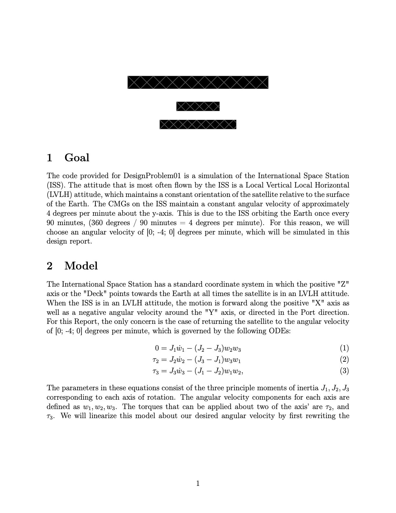
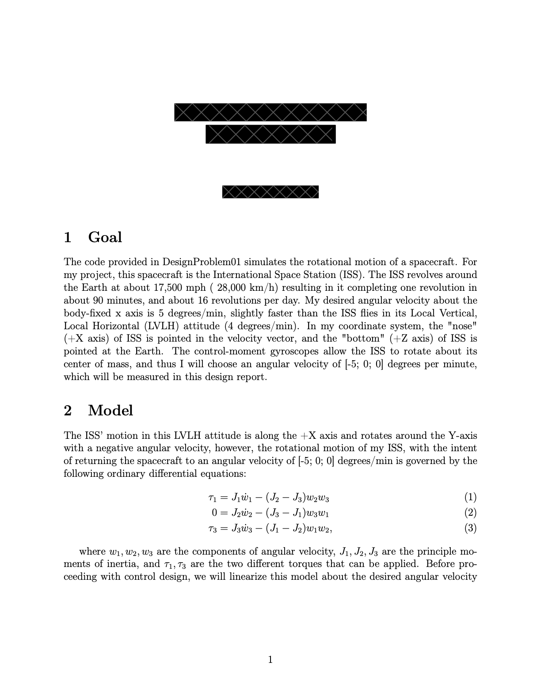
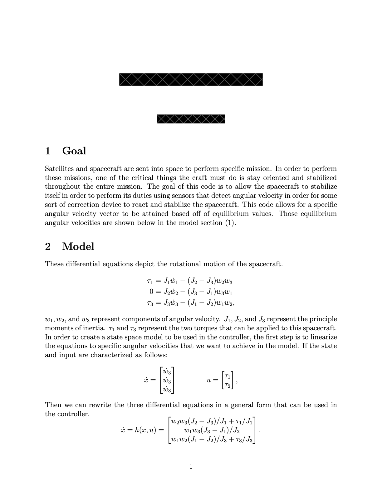
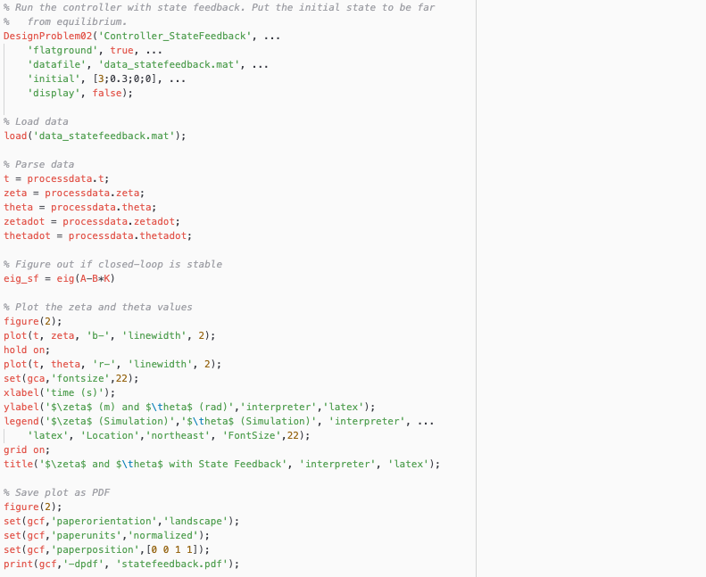
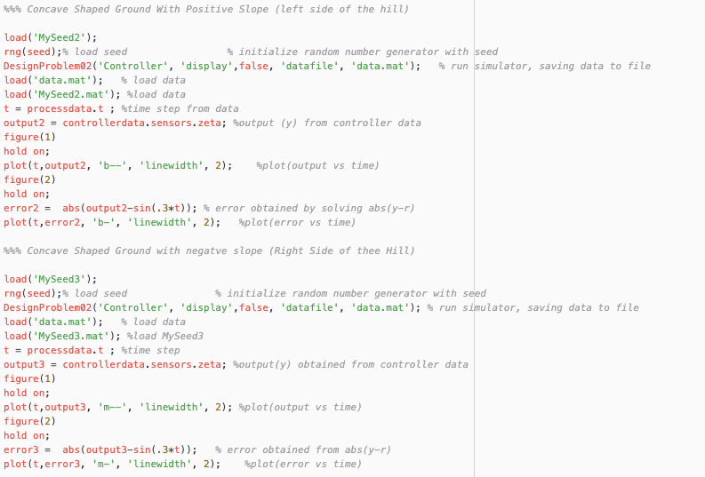
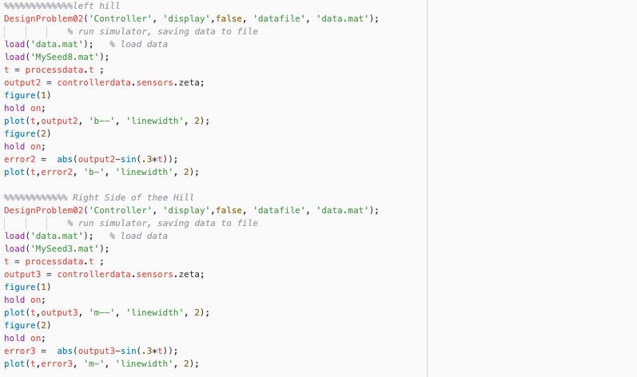

## Contents
{:.no_toc}

* This text will be replaced by a table of contents (excluding the above header) as an unordered list
{:toc}

---

## Week 1

### Day 01 (Monday, January 25)

* [Video](https://mediaspace.illinois.edu/media/t/1_bar216yw/)

### Day 02 (Wednesday, January 27)

* [Video](https://mediaspace.illinois.edu/media/t/1_ljjd2109/)
* [Survey](https://forms.gle/t2t6UiE2CD52uY5U6) to fill out by noon on Thursday, January 28
* [Example code (reaction wheel)](https://github.com/tbretl/ae353-sp21/tree/main/examples/day02_wheel)

### Day 03 (Friday, January 29)

* [Video](https://mediaspace.illinois.edu/media/t/1_5v9lh7ex/)
* [Survey](https://docs.google.com/forms/d/e/1FAIpQLScgviwethSHLY-vwlXShup-ZOQdwHvkS6Ja3LE1zNqCec0tUQ/viewform?usp=sf_link) to fill out by noon on Saturday, January 29
* [Example code (platform with reaction wheel)](https://github.com/tbretl/ae353-sp21/tree/main/examples/day03_platform)

## Week 2

### Day 04 (Monday, February 1)

* [Video](https://mediaspace.illinois.edu/media/t/1_wbfl2u7h/)
* [Survey](https://docs.google.com/forms/d/e/1FAIpQLScu_AqKqi-B9t9njAx_KBDNuj_hbOUUBAcddZ9mfz77HfaLiw/viewform?usp=sf_link) to fill out by noon on Tuesday, February 2

### Day 05 (Wednesday, February 3)

* [Video](https://mediaspace.illinois.edu/media/t/1_b2knpkxr/)
* [Survey](https://docs.google.com/forms/d/e/1FAIpQLSfnKNAvL2pvqKMWytEFgwcV1wjtv1hM8tGaFIEgftFFk2wUjQ/viewform?usp=sf_link) to fill out by noon on Thursday, February 4

### Day 06 (Friday, February 5)

* No synchronous lecture - see [Campuswire](https://campuswire.com/c/GC4DB42F3/feed/52)
* [Survey](https://docs.google.com/forms/d/e/1FAIpQLSfHxO8YWlPuwH61EjfuTDMUdQUOB4Ld9PlebFc5shD7q-IDIg/viewform?usp=sf_link) to fill out by noon on Saturday, February 6

## Week 3

### Day 07: State space models (Monday, February 8)

* [Video](https://mediaspace.illinois.edu/media/t/1_fidduyv4/)
* [Survey](https://docs.google.com/forms/d/e/1FAIpQLSewGF7LWstbUOCkd67Q-9WRWv42mIKPagolWSe8_YgukKTr1g/viewform?usp=sf_link) to fill out by noon on Tuesday, February 9
* [PrairieLearn HW1](https://www.prairielearn.org/pl/course_instance/128571/assessments)
* [Reference](/ae353-sp21/reference#what-is-a-state-space-model)
* [Design Project \#1 (CMG)](projects#design-project-1-cmg)

### Day 08: State space models for second-order systems (Wednesday, February 10)

* [Video](https://mediaspace.illinois.edu/media/t/1_h7de91r8/)
* [Survey](https://docs.google.com/forms/d/e/1FAIpQLSf8bVFLDRjSoKjiP-6RLtzHqi34imzE2Urefbt8EWherM0zpA/viewform?usp=sf_link) to fill out by noon on Thursday, February 11
* [PrairieLearn HW2](https://www.prairielearn.org/pl/course_instance/128571/assessments)
* [Reference](/ae353-sp21/reference#what-is-a-state-space-model)

### Day 09: Linearization (Friday, February 12)

* [Video](https://mediaspace.illinois.edu/media/t/1_wvvlq9th/)
* [Survey](https://docs.google.com/forms/d/e/1FAIpQLScl9UvLEaf2SgkV4g6axE1dm6awWDczaNQE685PUEE_v5xggg/viewform?usp=sf_link)
* [PrairieLearn HW3](https://www.prairielearn.org/pl/course_instance/128571/assessments)
* [Reference](/ae353-sp21/reference#how-do-i-put-a-system-in-state-space-form)

## Week 4

### Day 10: Matrix exponential (Monday, February 15)

* [Video](https://mediaspace.illinois.edu/media/t/1_kq40wxb3/)
* [Survey](https://docs.google.com/forms/d/e/1FAIpQLSfiDAHp38bCSl8jwwx1uE1ReFatkGBJcwp-sLRB7Ewr8yBvxw/viewform?usp=sf_link) (<a role="button" data-bs-toggle="collapse" href="#day10-survey-results" aria-expanded="false" aria-controls="day10-survey-results">Results</a>)
* [PrairieLearn HW4](https://www.prairielearn.org/pl/course_instance/128571/assessments)
* [Reference](/ae353-sp21/reference#the-matrix-exponential-function)

  

    <iframe width="600" height="371" seamless frameborder="0" scrolling="no" src="https://docs.google.com/spreadsheets/d/e/2PACX-1vQytsHGOojdiRyOQZ0feAofNh6iNnZ4ur-9W9yqoInBAYIUQpy1L8LhWp6cFthM4LisPLlPHwObfVUg/pubchart?oid=1975077170&amp;format=interactive"></iframe>
  

### Day 11: Stability - theory (Friday, February 19)

* [Video](https://mediaspace.illinois.edu/media/t/1_nmlr32b7/)
* [Survey](https://docs.google.com/forms/d/e/1FAIpQLSef5evvQ8QejLNKjhudoJOHBzhq1OKBrcf4c03pv3BT2DXeZQ/viewform?usp=sf_link) (<a role="button" data-bs-toggle="collapse" href="#day11-survey-results" aria-expanded="false" aria-controls="day11-survey-results">Results</a>)
* [PrairieLearn HW5](https://www.prairielearn.org/pl/course_instance/128571/assessments)
* [Notes (Before Class)](./notes/Day11-Stability.pdf)
* [Notes (After Class)](./notes/Day11-Stability-InClass.pdf)

  

    <iframe width="600" height="371" seamless frameborder="0" scrolling="no" src="https://docs.google.com/spreadsheets/d/e/2PACX-1vSBTE53S_476duhNxZ4CaxMvftrYTWnO-CuyYujWw61-OTfuJSbGtmIZJ9G7SSXBe-5kHCRVDDnWGl4/pubchart?oid=1632284622&amp;format=interactive"></iframe>
  

## Week 5

### Day 12: Stability - practice (Monday, February 22)

* [Video](https://mediaspace.illinois.edu/media/t/1_90ghqyz9/)
* [Survey](https://docs.google.com/forms/d/e/1FAIpQLSfBerRthhQzixcO5tPznkSz8i8pqI_BkssU2RE14niRaNthrg/viewform?usp=sf_link) (<a role="button" data-bs-toggle="collapse" href="#day12-survey-results" aria-expanded="false" aria-controls="day12-survey-results">Results</a>)
* [PrairieLearn HW6](https://www.prairielearn.org/pl/course_instance/128571/assessments)
* [Example code](https://github.com/tbretl/ae353-sp21/tree/main/examples/day12_platform) - there are two notebooks here, one [before class](https://github.com/tbretl/ae353-sp21/blob/main/examples/day12_platform/PlatformDemo.ipynb) and one [after class](https://github.com/tbretl/ae353-sp21/blob/main/examples/day12_platform/PlatformDemo-InClass.ipynb)

  

    <iframe width="600" height="371" seamless frameborder="0" scrolling="no" src="https://docs.google.com/spreadsheets/d/e/2PACX-1vT_XRO80dwhdhPl8-u7aV8f66csIV6O5A-iapgvPAOZNh3XMBnt637WC92TLyopxSsnBx6SXYwYccRh/pubchart?oid=846249499&amp;format=interactive"></iframe>
  

### Day 13: Project - getting started (Wednesday, February 24)

* [Video](https://mediaspace.illinois.edu/media/t/1_8ilzpcnc/)
* [Survey](https://docs.google.com/forms/d/e/1FAIpQLSfnXKbIok1dz6poh0MhR-n0g6McsBS3KgH-cLp5zsaTLpszIg/viewform?usp=sf_link) (<a role="button" data-bs-toggle="collapse" href="#day13-survey-results" aria-expanded="false" aria-controls="day13-survey-results">Results</a>)
* [Example code](https://github.com/tbretl/ae353-sp21/tree/main/examples/day13_cmg) - in particular, see [this notebook](https://github.com/tbretl/ae353-sp21/blob/main/examples/day13_cmg/CMGDemo-InClass.ipynb) for how to implement PD control

  

    <iframe width="600" height="371" seamless frameborder="0" scrolling="no" src="https://docs.google.com/spreadsheets/d/e/2PACX-1vQydUZQhbIIOP7tXtWpCLSCkyMKHDISYdwEGmWsGAaS5VAuROU84gJCuuyAeiNOFuhsRunXBYZWD0ED/pubchart?oid=1144405121&amp;format=interactive"></iframe>
  

### Day 14: Project - working together (Friday, February 26)

* [Video](https://mediaspace.illinois.edu/media/t/1_4408udcb/)
* [Survey](https://docs.google.com/forms/d/e/1FAIpQLSdY2CukZRpcu6oRL_5AC9T7iiK_UhXFWntrjqrsGMMkf9cCsA/viewform?usp=sf_link) (<a role="button" data-bs-toggle="collapse" href="#day14-survey-results" aria-expanded="false" aria-controls="day14-survey-results">Results</a>)
* [Example code](https://github.com/tbretl/ae353-sp21/tree/main/examples/day14_cmg) - in particular, see [this notebook](https://github.com/tbretl/ae353-sp21/blob/main/examples/day14_cmg/CMGDemo-InClass.ipynb) for:
  - how to implement linear state feedback
  - how to choose (or randomize) non-zero initial conditions
  - how to take a snapshot of the simulation
* Some old reports for in-class discussion:
  - <a role="button" data-bs-toggle="collapse" href="#report01" aria-expanded="false" aria-controls="report01">Report 01</a>
  - <a role="button" data-bs-toggle="collapse" href="#report02" aria-expanded="false" aria-controls="report02">Report 02</a>
  - <a role="button" data-bs-toggle="collapse" href="#report03" aria-expanded="false" aria-controls="report03">Report 03</a>
* Some old code for in-class discussion:
  - <a role="button" data-bs-toggle="collapse" href="#code01" aria-expanded="false" aria-controls="code01">Code 01</a>
  - <a role="button" data-bs-toggle="collapse" href="#code02" aria-expanded="false" aria-controls="code02">Code 02</a>
  - <a role="button" data-bs-toggle="collapse" href="#code03" aria-expanded="false" aria-controls="code03">Code 03</a>

{: .collapse #report01 .card .card-body}
**REPORT 01**

{: .collapse #report02 .card .card-body}
**REPORT 02**

{: .collapse #report03 .card .card-body}
**REPORT 03**

{: .collapse #code01 .card .card-body}
**CODE 01**

{: .collapse #code02 .card .card-body}
**CODE 02**

{: .collapse #code03 .card .card-body}
**CODE 03**

  

    <iframe width="600" height="371" seamless frameborder="0" scrolling="no" src="https://docs.google.com/spreadsheets/d/e/2PACX-1vTUott8btZeD4_GzQ9Pn1_rLvne-vYTbY26SKRdr0TvU-v3W29B5f2lHGMfk94_4DDMxU9sypkab_jL/pubchart?oid=1412967962&amp;format=interactive"></iframe>
  

## Week 6

### Day 15: Eigenvalue placement (Monday, March 1)

* [Video](https://mediaspace.illinois.edu/media/t/1_hnt46jl3/)
* [Survey](https://docs.google.com/forms/d/e/1FAIpQLSde-VVpg-nbl3O23iFCueGW7oC23jvHFhLdHsTgvUPpskc5nQ/viewform?usp=sf_link) (<a role="button" data-bs-toggle="collapse" href="#day15-survey-results" aria-expanded="false" aria-controls="day15-survey-results">Results</a>)
* [Notes (After Class)](./notes/Day15-EigenvaluePlacement-InClass.pdf)
* [Example code](https://github.com/tbretl/ae353-sp21/tree/main/examples/day15_platform) - in particular, see [this notebook](https://github.com/tbretl/ae353-sp21/blob/main/examples/day15_platform/PlatformDemo-InClass.ipynb) for an example of how to do eigenvalue placement with [scipy.signal.place_poles](https://docs.scipy.org/doc/scipy/reference/generated/scipy.signal.place_poles.html)
* [PrairieLearn HW7](https://www.prairielearn.org/pl/course_instance/128571/assessments)

  

    <iframe width="600" height="371" seamless frameborder="0" scrolling="no" src="https://docs.google.com/spreadsheets/d/e/2PACX-1vSs4szMg3QQi-2MPj8KyBhpjvbJkvqB_jHTqbBtfg5ebp7zhdrArhsufjusRNz_GcUJSi97m7VfDbYH/pubchart?oid=1618366998&amp;format=interactive"></iframe>
  

### Day 16: Second design project - getting started (Wednesday, March 3)

* [Video](https://mediaspace.illinois.edu/media/t/1_hw6im1lh/)
* [Survey](https://docs.google.com/forms/d/e/1FAIpQLSfKpKDbcBuGFryTBTW-sYjBH5V7wBmqa3Rk2t3ZSRaflrgDBw/viewform?usp=sf_link) (<a role="button" data-bs-toggle="collapse" href="#day16-survey-results" aria-expanded="false" aria-controls="day16-survey-results">Results</a>)
* [Design Project \#2 (Differential-drive robot)](projects#design-project-2-differential-drive-robot)
* [Example code](https://github.com/tbretl/ae353-sp21/tree/main/examples/day16_segbot) - in particular, see [this notebook](https://github.com/tbretl/ae353-sp21/blob/main/examples/day16_segbot/SegbotDemo-InClass.ipynb) for a PD controller that keeps the robot upright

  

    <iframe width="600" height="371" seamless frameborder="0" scrolling="no" src="https://docs.google.com/spreadsheets/d/e/2PACX-1vShghvhJz1USdz3A3j_h2WClfhU98RRWgrNH_RijyVqIZwzrOvSKRZd-xYioxF6uGeQYnJBAuxPGnTk/pubchart?oid=1908463829&amp;format=interactive"></iframe>
  

### Day 17: Ackermann's method - controllable canonical form (Friday, March 5)

* [Video](https://mediaspace.illinois.edu/media/t/1_hmlrvmv1/)
* [Survey](https://docs.google.com/forms/d/e/1FAIpQLScILM7dwAbDbljh7sGUIvc5jJeCLDpmitX4lEzYo1nAEXPkvA/viewform?usp=sf_link) (<a role="button" data-bs-toggle="collapse" href="#day17-survey-results" aria-expanded="false" aria-controls="day17-survey-results">Results</a>)
* [Notes (Before Class)](./notes/Day17-Acker.pdf)
* [Notes (After Class)](./notes/Day17-Acker-InClass.pdf)
* [Example code](https://github.com/tbretl/ae353-sp21/tree/main/examples/day17_ccf/CCF-demos.ipynb)
* Supplementary videos on the details of Ackermann's method:
  - [Ackermann's Method, Part 1: Eigenvalues are invariant to coordinate transformation](https://mediaspace.illinois.edu/media/t/1_93vewoav/)
  - [Ackermann's Method, Part 2: Controllable canonical form](https://mediaspace.illinois.edu/media/t/1_rbf0x31w/)
  - [Ackermann's Method, Part 3: How to put a system in controllable canonical form](https://mediaspace.illinois.edu/media/t/1_e6r6ljxc/)
  - [Ackermann's Method, Part 4: Putting it all together](https://mediaspace.illinois.edu/media/t/1_sf1ydkq4/)
* [PrairieLearn HW8](https://www.prairielearn.org/pl/course_instance/128571/assessments)

  

    <iframe width="600" height="371" seamless frameborder="0" scrolling="no" src="https://docs.google.com/spreadsheets/d/e/2PACX-1vTdUCOy6Rr24D7G1Q6F-YDk7IL9z4M-OkQL0e5QOu-Ho4qD8f_Iw4XngM9dMfb-FmTolER_OFexEoB2/pubchart?oid=1421442809&amp;format=interactive"></iframe>
  

## Week 7

### Day 18: Ackermann's method - implications for controllability (Monday, March 8)

* [Video](https://mediaspace.illinois.edu/media/t/1_9d7uv2dc/)
* [Survey](https://docs.google.com/forms/d/e/1FAIpQLSeAPG_Uq04tIH8kWoMyF8HbNS_5A02XG_3y077J3vjRhtQTJw/viewform?usp=sf_link) (<a role="button" data-bs-toggle="collapse" href="#day18-survey-results" aria-expanded="false" aria-controls="day18-survey-results">Results</a>)
* [Notes (Before Class)](./notes/Day18-Controllability.pdf)
* [Notes (After Class)](./notes/Day18-Controllability-InClass.pdf)
* [PrairieLearn HW9](https://www.prairielearn.org/pl/course_instance/128571/assessments)

  

    <iframe width="600" height="371" seamless frameborder="0" scrolling="no" src="https://docs.google.com/spreadsheets/d/e/2PACX-1vTLnBdQKRjI-OMibJg8XAChQqP7w3OofbZeX_vePYiq8QWRUKdKh8sFppPBaBF2UGk3zd-cRfwFnmkd/pubchart?oid=717280055&amp;format=interactive"></iframe>
  

### Day 19: Examples of what it means for a system to be controllable (Wednesday, March 10)

* [Video](https://mediaspace.illinois.edu/media/t/1_hnn8rvm2/)
* [Survey](https://docs.google.com/forms/d/e/1FAIpQLSemeHLQnWaiDCpE3CthZqkkeKaRAkVBLO-Jwzdh8IFtXIw1KA/viewform?usp=sf_link) (<a role="button" data-bs-toggle="collapse" href="#day19-survey-results" aria-expanded="false" aria-controls="day19-survey-results">Results</a>)
* [Example code](https://github.com/tbretl/ae353-sp21/tree/main/examples/day19_controllability/) — in particular, see [this notebook](https://github.com/tbretl/ae353-sp21/tree/main/examples/day19_controllability/ExamplesOfControllability.ipynb) for many examples of how to check if a system is controllable

  

    <iframe width="600" height="371" seamless frameborder="0" scrolling="no" src="https://docs.google.com/spreadsheets/d/e/2PACX-1vRee2HZDmwynXpALVzR0pjh8DcD4j4zcdP9eEf98x_NZwA8qHRjd5lJJZ61cg7KOUsLSFqL3bwGF9HE/pubchart?oid=861225748&amp;format=interactive"></iframe>
  

### Day 20: How to improve your design projects (Friday, March 12)

* [Video](https://mediaspace.illinois.edu/media/t/1_dgtyn48w/)
* [Survey](https://docs.google.com/forms/d/e/1FAIpQLSfvfIBxZA--KsSlgtFSGR9lEvWpl4rJqE-zQ6qszH5LaLbrGA/viewform?usp=sf_link) (<a role="button" data-bs-toggle="collapse" href="#day20-survey-results" aria-expanded="false" aria-controls="day20-survey-results">Results</a>)
* [Form to submit a project revision](https://docs.google.com/forms/d/e/1FAIpQLSf_mNfpDIt40F5JforQAA54fyc4Q_WgCG-vmPNQV8atj2oh-w/viewform?usp=sf_link)
* [Shared document for collaborative in-class discussion about how to do your own work when collaborating with others](https://docs.google.com/document/d/1CYrNM3l2_w0XKv_xb5GccqLOrFv9USyypcXsEJxhmhk/edit?usp=sharing)

  

    <iframe width="600" height="371" seamless frameborder="0" scrolling="no" src="https://docs.google.com/spreadsheets/d/e/2PACX-1vQZmb31F-uu0SHwtP9RRG5vxKmQDueMO5Ose6LeasO-iRoboNj3EGQ0d0Yn2q6_JeN-4Jxs_-nSbmlz/pubchart?oid=1288860890&amp;format=interactive"></iframe>
  

## Week 8

### Day 21: LQR - scalar example (Monday, March 15)

* [Video](https://mediaspace.illinois.edu/media/t/1_gk0vqpgw/)
* [Survey](https://docs.google.com/forms/d/e/1FAIpQLSfmkIEg8khvf6DrF-arOlqBN5zt5lK8pPxp2qjC6SF6wQCi-g/viewform?usp=sf_link) (<a role="button" data-bs-toggle="collapse" href="#day21-survey-results" aria-expanded="false" aria-controls="day21-survey-results">Results</a>)
* [Example code](https://github.com/tbretl/ae353-sp21/tree/main/examples/day21_lqr_cost/)
* [PrairieLearn HW10](https://www.prairielearn.org/pl/course_instance/128571/assessments)

  

    <iframe width="600" height="371" seamless frameborder="0" scrolling="no" src="https://docs.google.com/spreadsheets/d/e/2PACX-1vRNsjHB1wfMlBuXrRPDXpdN-jQD1ce9MPWs0t3QmzStiM0p8gxgV7PvVGnmP2Tv12pJHZizF6U4KR76/pubchart?oid=1729381461&amp;format=interactive"></iframe>
  

### Day 22: LQR - effect of initial conditions and of weights (Wednesday, March 17)

* [Video](https://mediaspace.illinois.edu/media/t/1_vjy0xwiy/)
* [Survey](https://docs.google.com/forms/d/e/1FAIpQLSfsXOl_Zy6qbGMZLoIp99PKZxCbPX_0n67F13R9nWPR-jRCGQ/viewform?usp=sf_link) (<a role="button" data-bs-toggle="collapse" href="#day22-survey-results" aria-expanded="false" aria-controls="day22-survey-results">Results</a>)
* [Example code](https://github.com/tbretl/ae353-sp21/tree/main/examples/day22_lqr_ics_and_weights/)

  

    <iframe width="600" height="371" seamless frameborder="0" scrolling="no" src="https://docs.google.com/spreadsheets/d/e/2PACX-1vRnz1g7xp5GpNhfamZ8YFjd69i-XtleTGrzVw1OHH-7fzRkA3_fcF_fnX1i93OfJbMwqX2z-q40JOJM/pubchart?oid=399715586&amp;format=interactive"></iframe>
  

### Day 23: LQR - general statement and example application (Friday, March 19)

* [Video](https://mediaspace.illinois.edu/media/t/1_7hrz89kz/)
* [Survey](https://docs.google.com/forms/d/e/1FAIpQLSfjQMS2XLYGRv3_QrRkfDa-NjdIzew3wyOXe3rvCOKr-jbBtQ/viewform?usp=sf_link) (<a role="button" data-bs-toggle="collapse" href="#day23-survey-results" aria-expanded="false" aria-controls="day23-survey-results">Results</a>)

  

    <iframe width="600" height="371" seamless frameborder="0" scrolling="no" src="https://docs.google.com/spreadsheets/d/e/2PACX-1vQyc3rZB8rkzTMd38iJ39LrfLnFoQTVuDejNwXBqHYjUhNaB2-elRRh6fjr2aIpok4ihdmO4u8kWb56/pubchart?oid=2116592378&amp;format=interactive"></iframe>
  

## Week 9

### Day 24: How to avoid self-plagiarism, and what to do if we can only measure part of the state (Monday, March 22)

* [Video](https://mediaspace.illinois.edu/media/t/1_zl94rvms/)
* [Survey](https://docs.google.com/forms/d/e/1FAIpQLScBugTuhp0AIyAocD-tSHomw73T0GfVh7HTWIbujTZl3oD8tw/viewform?usp=sf_link) (<a role="button" data-bs-toggle="collapse" href="#day24-survey-results" aria-expanded="false" aria-controls="day24-survey-results">Results</a>)

  

    <iframe width="600" height="371" seamless frameborder="0" scrolling="no" src="https://docs.google.com/spreadsheets/d/e/2PACX-1vQkxilYYf4CgQ2zw7Jdlnlm6CFFP9XXiEwDjPp5j_6j6UaTDgCDsrj5YwGxUe8hg_vWM0XoW6jtto_b/pubchart?oid=2101452987&amp;format=interactive"></iframe>
  

### Day 25: Design project \#3 - getting started (Friday, March 26)

* [Video](https://mediaspace.illinois.edu/media/t/1_ch4za3ak/)
* [Survey](https://docs.google.com/forms/d/e/1FAIpQLSc3w3ilZeYIZgo_wxje2mrA0W4gUhn5jpv7qS0g9UAk4PZF4A/viewform?usp=sf_link) (<a role="button" data-bs-toggle="collapse" href="#day25-survey-results" aria-expanded="false" aria-controls="day25-survey-results">Results</a>)
* [Design Project \#3 (Spacecraft with star tracker)](projects#design-project-3-spacecraft-with-star-tracker)
* [Example code](https://github.com/tbretl/ae353-sp21/tree/main/examples/day25_spacecraft) - playing around with the third design project

  

    <iframe width="600" height="371" seamless frameborder="0" scrolling="no" src="https://docs.google.com/spreadsheets/d/e/2PACX-1vSyFeAiCTfwsj5IiT30DIdTT3BZkQA7_u9-HZClTQxg2xaNPBdRY1J5eKzGxdULcb_YkSSuOt6vHLev/pubchart?oid=1813633019&amp;format=interactive"></iframe>
  

## Week 10

### Day 26: Finite difference approximation does not work with noisy sensor measurements (Monday, March 29)

* [Video](https://mediaspace.illinois.edu/media/t/1_1af2rp5s/)
* [Survey](https://docs.google.com/forms/d/e/1FAIpQLSc7Cff_Ra5BzdErxWebHx0JRh3t2TiWVojVV_sVLSaCUXRvjA/viewform?usp=sf_link) (<a role="button" data-bs-toggle="collapse" href="#day26-survey-results" aria-expanded="false" aria-controls="day26-survey-results">Results</a>)
* [PrairieLearn HW11](https://www.prairielearn.org/pl/course_instance/128571/assessments)

  

    <iframe width="600" height="371" seamless frameborder="0" scrolling="no" src="https://docs.google.com/spreadsheets/d/e/2PACX-1vR1mcC-r7jqD5goUzFz9NjqvDP-ZYcQudL2WGngpL9Y8b9iHPJdatGpM-jT6h7QVmLl-6MjtXV8tl7g/pubchart?oid=1190991108&amp;format=interactive"></iframe>
  

### Day 27: How to implement an observer (Wednesday, March 31)

* [Video](https://mediaspace.illinois.edu/media/t/1_8gszecaz/)
* [Survey](https://docs.google.com/forms/d/e/1FAIpQLSdSkJu3qCW4mH2O56AvZpZWmYmTVk4hTqctUNkipoAPhJJP8w/viewform?usp=sf_link) (<a role="button" data-bs-toggle="collapse" href="#day27-survey-results" aria-expanded="false" aria-controls="day27-survey-results">Results</a>)
* [Example code](https://github.com/tbretl/ae353-sp21/tree/main/examples/day27_platform_observer)
* Supplementary videos on the details of observer design and analysis:
  - [Observers, Part 1: What is an observer?](https://mediaspace.illinois.edu/media/t/1_bwsv03zv/)
  - [Observers, Part 2: Do observers make sense?](https://mediaspace.illinois.edu/media/t/1_xf9cytda/)
  - [Observers, Part 3: When does an observer work?](https://mediaspace.illinois.edu/media/t/1_ma7mf2v3/)
  - [Observers, Part 4: How to choose L for an observer?](https://mediaspace.illinois.edu/media/t/1_6kd1vo4k/)
  - [Observers, Part 5: Do observers break controllers?](https://mediaspace.illinois.edu/media/t/1_93pesfka/)
  - [Observers, Part 6: When is observer design possible?](https://mediaspace.illinois.edu/media/t/1_rxgahknr/)

  

    <iframe width="600" height="371" seamless frameborder="0" scrolling="no" src="https://docs.google.com/spreadsheets/d/e/2PACX-1vQTf5h7U6ymA1tmAefaYWJr8lSjuxvvDgnYKG44cg2FT-rNdWaeYouWdp4qouXRXGmLnb_hhgr-sPFk/pubchart?oid=1204481877&amp;format=interactive"></iframe>
  

### Day 28: Observer design and analysis (Friday, April 2)

* [Video](https://mediaspace.illinois.edu/media/t/1_kkmbsupf/)
* [Survey](https://docs.google.com/forms/d/e/1FAIpQLSfQOHr0APdmkWMlO6QQYocLfDmJIRj-1Qd__kYcdx8MPt3OUw/viewform?usp=sf_link) (<a role="button" data-bs-toggle="collapse" href="#day28-survey-results" aria-expanded="false" aria-controls="day28-survey-results">Results</a>)
* [Example code](https://github.com/tbretl/ae353-sp21/tree/main/examples/day28_platform_observer)
* [Notes (Before Class)](./notes/Day28-ObserverDesign.pdf)
* [Notes (After Class)](./notes/Day28-ObserverDesign-InClass.pdf)

  

    <iframe width="600" height="371" seamless frameborder="0" scrolling="no" src="https://docs.google.com/spreadsheets/d/e/2PACX-1vTHDuEB-pcLpPJ0iR8MzKT5aJCGWMI4NZ48HK-8IqX9wLaYlnU7VfmhXHMFihTY4eFMSEdm-8pjjMnS/pubchart?oid=2000897737&amp;format=interactive"></iframe>
  

## Week 11

### Day 29: More observer design and analysis - the full system, linearization, optimality (Monday, April 5)

* [Video](https://mediaspace.illinois.edu/media/t/1_njl1hroj/)
* [Survey](https://docs.google.com/forms/d/e/1FAIpQLSc7Lh3N8WMPhHPo66rpBlHAAb1iDBEpW5J0qLGwgt_6yjitGQ/viewform?usp=sf_link) (<a role="button" data-bs-toggle="collapse" href="#day29-survey-results" aria-expanded="false" aria-controls="day29-survey-results">Results</a>)
* [Example code](https://github.com/tbretl/ae353-sp21/tree/main/examples/day29_platform_observer)
* [Notes (Before Class)](./notes/Day29-ObserverDesignPart2.pdf)
* [Notes (After Class)](./notes/Day29-ObserverDesignPart2-InClass.pdf)

  

    <iframe width="600" height="371" seamless frameborder="0" scrolling="no" src="https://docs.google.com/spreadsheets/d/e/2PACX-1vRt__ANmcKTlYeDjy0s_c2izCsJYp0AeuYgrpLBTRqqk57ulriiBe8f0Dtk9oPovFM-w3VPyBX1Z5RA/pubchart?oid=1242320455&amp;format=interactive"></iframe>
  

### Day 30: Nonlinear sensor model (Wednesday, April 7)

* [Video](https://mediaspace.illinois.edu/media/t/1_x6zw3b0p/)
* [Survey](https://docs.google.com/forms/d/e/1FAIpQLSdSYWcYaa5xf3I9l_pnyI9cgnDwuJTGAqHq11Zr3sxSNYLO5Q/viewform?usp=sf_link) (<a role="button" data-bs-toggle="collapse" href="#day30-survey-results" aria-expanded="false" aria-controls="day30-survey-results">Results</a>)
* [Example code](https://github.com/tbretl/ae353-sp21/tree/main/examples/day30_spacecraft_sensors)
* [Notes](./notes/Day30-NonlinearSensorModels.pdf)

  

    <iframe width="600" height="371" seamless frameborder="0" scrolling="no" src="https://docs.google.com/spreadsheets/d/e/2PACX-1vSTS-CwhIAlaH_KA5sicP9kE8_HQM_ulS2TZaWGqabXDTHLjivgQNOG-IMc1BsrY3EG6mdF_qOClh8q/pubchart?oid=151039306&amp;format=interactive"></iframe>
  

### Day 31: Optimal observer design (Friday, April 9)

* [Video](https://mediaspace.illinois.edu/media/t/1_incinfl8/)
* [Survey](https://docs.google.com/forms/d/e/1FAIpQLScb0aUtjJ_bZ04R-p8nyl_L9thjETaqBjbtx33S2YsCFDDqmg/viewform?usp=sf_link)
* [Example code](https://github.com/tbretl/ae353-sp21/tree/main/examples/day31_optimal_observers)
* [Notes](./notes/Day31-OptimalObservers.pdf)
* Supplementary videos on the details of optimal observer design:
  - [Optimal Observers, Part 1: What is an optimal observer?](https://mediaspace.illinois.edu/media/t/1_m5ku4a2i/)
  - [Optimal Observers, Part 2: What problem is solved to produce an optimal observer?](https://mediaspace.illinois.edu/media/t/1_cvfqo0i0/)
  - [Optimal Observers, Part 3: Do optimal observers make any sense at all?](https://mediaspace.illinois.edu/media/t/1_axx6h2yg/)
